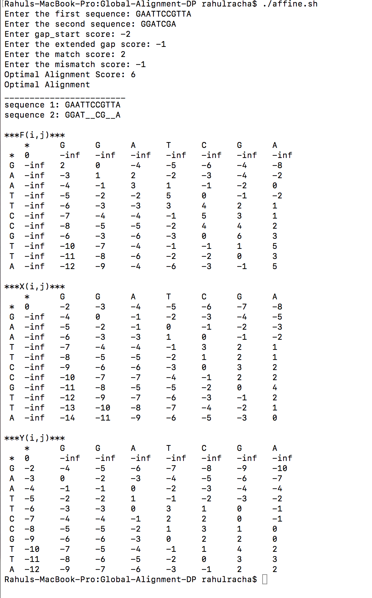

# Global-Alignment-DP
Implementation of Global Alignment Dynamic Programming Algorithm using Affine-Gap Penalty.

## *__Requirement__*
C++ compiler

## *__Run__*
chmod +x affine.sh (grant permission to run the script)

./affine.sh

## *__Sample output__*

